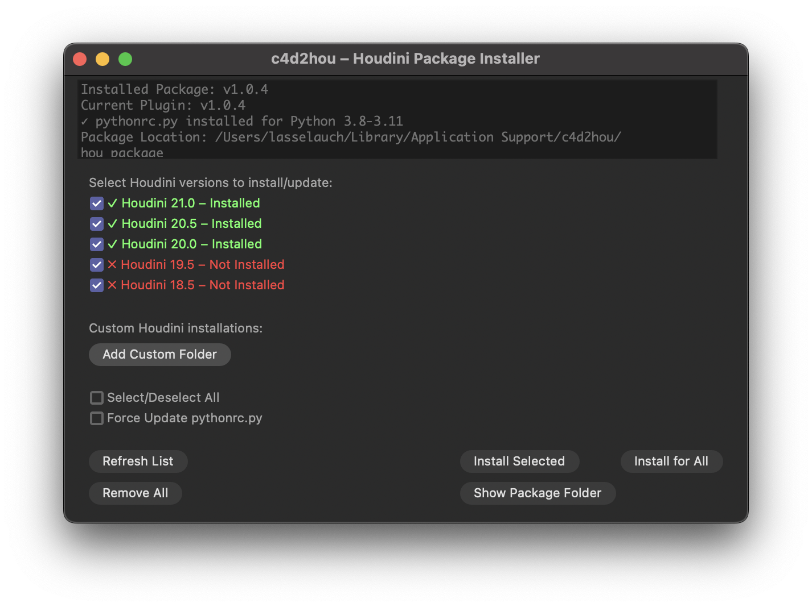
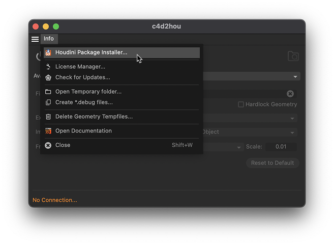

# 📦 How to Install

Complete installation guide for C4D2HOU - the professional Cinema 4D to Houdini bridge.
{: .fs-5 .fw-300 }
---

## Step 1: Install the Cinema 4D Plugin

### Option A: Using aescripts Manager (Recommended)

[](https://aescripts.com/learn/aescripts-aeplugins-manager-app/){:target="_blank"}

1. **Download** the aescripts Manager from [aescripts.com](https://aescripts.com/learn/aescripts-aeplugins-manager-app/)
2. **Search** for "c4d2hou" in the manager
3. **Click Install** - the plugin will be installed automatically

### Option B: Manual Installation

1. **Download** c4d2hou from [aescripts.com](https://aescripts.com/c4d2hou)
2. **Extract** the ZIP file
3. **Copy** the `c4d2hou` folder to your Cinema 4D plugins directory:

```
Windows: C:/Program Files/MAXON/CINEMA 4D <version>/plugins/
macOS:   /Applications/MAXON/CINEMA 4D <version>/plugins/
```

---

## Step 2: First Launch & Package Installation

### Start: Cinema 4D

The plugin is now ready to guide you through the Houdini setup. Navigate to **Extensions** → **c4d2hou** to open the plugin dialog.

## Automatic Package Installation

C4D2HOU detects if Houdini package installation is needed



1. **Package Installer** opens automatically
2. **Select Houdini versions** you want to use with C4D2HOU
3. **Click "Install Selected"** - the plugin handles everything else

### That's it! 🎉

Start Houdini and you're ready to connect.
The entire setup is now complete.

### Note on Add Custom Folder
When using "Add Custom Folder", specify Houdini's user preferences directory, NOT the program installation directory:

- **Windows:** `C:/Users/<username>/Documents/houdini<version>`
- **macOS:** `~/Library/Preferences/houdini/<version>`

*If unsure about your directory location, check the `$HOUDINI_USER_PREF_DIR` variable from within Houdini's Python shell.*

## Understanding the Package Installer
The Package Installer shows all detected Houdini installations with status indicators:

| Status | Meaning | Action Needed |
|:-------|:--------|:--------------|
| ☑️ Pre-selected | Not installed yet | Will be installed |
| ✅ Green | Already installed | No action needed |
| ⚠️ Orange | Outdated or orphaned | Should be updated |
| ❌ Red | Not installed | Select to install |

Use **"Install for All"** or **"Remove All"** to quickly manage multiple versions.

---

## Managing Your Installation

**Extensions** → **c4d2hou** → **Info** → **Houdini Package Installer...**



### Access Package Manager Anytime

Use this to:
- Install for new Houdini versions
- Update after plugin upgrades
- Remove packages when needed
- Check installation status

### Package Storage Location

C4D2HOU stores its Houdini package files in a persistent location that survives plugin updates:

| Platform | Location |
|:---------|:---------|
| Windows | `%APPDATA%\c4d2hou\hou_package\` |
| macOS | `~/Library/Application Support/c4d2hou/hou_package/` |

---

## Quick Troubleshooting

### Can't connect to Houdini?

1. **Restart Houdini** after package installation
2. **Check both apps** are running
3. **Verify installation** via Package Manager
4. **Force update** if you recently updated the plugin

### Need to reinstall?

Simply open the Package Manager and click "Install Selected" or "Install for All" again.

---

## System Requirements

| Component | Requirement |
|:----------|:------------|
| Cinema 4D | 2023 or newer |
| Houdini | 19.5 or newer (Python 3.8-3.11) |
| OS | Windows 10/11, macOS 10.14+ |

---

## Need Help?

[FAQ]({{site.baseurl}}/faq){: .btn .btn-orange .mr-2 }
[Support](mailto:support@aescripts.com){: .btn }
[Forums](https://aescripts.com/forums/){: .btn }
[Submit Issue](https://github.com/lasselauch/c4d2hou-docs/issues){: .btn .btn-blue .float-right}

[Back to top](#top){: .btn .float-right}

<div class="footer-info">
  <span class="connection-status">Built with 💙🧡 in Hamburg, Germany</span>
</div>

<link rel="stylesheet" href="{{ '/assets/css/general.css' | relative_url }}">