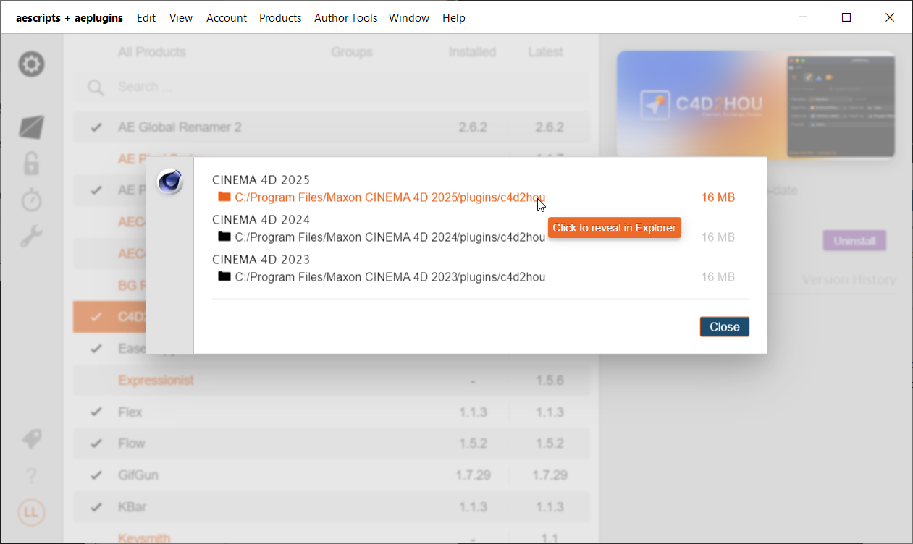
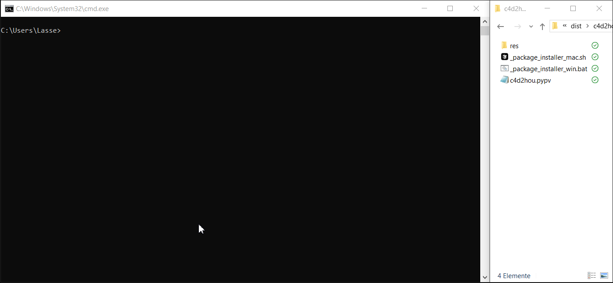

# 📦 How to Install

Complete installation guide for C4D2HOU - the professional Cinema 4D to Houdini bridge.
{: .fs-5 .fw-300 }
---
<!-- [Download: aescripts.com](https://aescripts.com/c4d2hou){: .btn .btn-orange } -->

## Method 1: aescripts Manager (Recommended)

[](https://aescripts.com/learn/aescripts-aeplugins-manager-app/){:target="_blank"}


The easiest way to install C4D2HOU is through the **aescripts + aeplugins Manager**:

1. **Download** the manager from [aescripts.com](https://aescripts.com/learn/aescripts-aeplugins-manager-app/) (or click on the image above.)
2. **Search** for "c4d2hou" in the manager
3. **Click Install** and follow the prompts, this will install the Cinema4D plugin

---

## After C4D Installation

1. Click on the installed versions and open **Cinema 4D plugins directory**
  
2. Within the `c4d2hou` folder **Drag the _package_installer_** into your `terminal.app` or `cmd.exe`
  
3. Select which Houdini version(s) to install
4. Done!🎉 **Start Cinema4D and Houdini and enjoy!**✨

---

## Method 2: Manual Installation

For users who prefer manual control over their installation process.

### Step 1: Install Cinema 4D Plugin

```
c4d2hou_v{x.x.x}.zip
├── 📂 c4d2hou                    ← Copy this folder!
│   ├── 📂 res
│   ├── _package_installer_mac.sh     (macOS/Linux installer)
│   ├── _package_installer_win.bat    (Windows installer)
│   └── c4d2hou.pypv
└── CHANGELOG.txt
└── README.txt
```

**Extract the zip** and copy the `c4d2hou` folder to your Cinema 4D plugins directory: 

```
C:/Program Files/MAXON/CINEMA 4D <version>/plugins/c4d2hou  (Windows)
/Applications/MAXON/CINEMA 4D <version>/plugins/c4d2hou     (macOS)
```

### Step 2: Install Houdini Package

<details markdown="block">
  <summary>
    Option A: Use Installer Scripts ✨
  </summary>
1. Navigate to the Cinema 4D plugins directory and within the c4d2hou plugin folder
2. **Drag the _package_installer_** into your terminal or cmd prompt and follow the instructions
  
3. Select which Houdini version(s) to install for
4. Done! 🎉
</details>

<details markdown="block">
  <summary>
    Option B: Manual JSON Installation
  </summary>

1. Create `c4d2hou.json`:

```json
{
    "enable": true,
    "load_package_once": true,
    "env": [{
        "c4d2hou": "__path_to_c4d_plugins_folder__/c4d2hou/res/hou_package"
    }],
    "path": "$c4d2hou"
}
```

2. Replace `__path_to_c4d_plugins_folder__` with your actual path to your Cinema4D plugins directory

3. Save to:
  ```
  C:/Users/<username>/Documents/houdini<version>/packages/              (Windows)
  /Users/<username>/Library/Preferences/houdini/<version>/packages/     (macOS)
  ```

</details>

---

## Step 3: Start Using C4D2HOU

1. **Start Cinema 4D**
2. **Start Houdini**
3. In Cinema 4D: **Extensions** → **c4d2hou**
4. **Click** [Connect]({{site.baseurl}}/overview)
5. **Enjoy!** 🚀

---

## Need Help?

[FAQ]({{site.baseurl}}/faq){: .btn .btn-orange .mr-2 }
[Support](mailto:support@aescripts.com){: .btn }
[Forums](https://aescripts.com/forums/){: .btn }
[Submit Issue](https://github.com/lasselauch/c4d2hou-docs/issues){: .btn .btn-blue .float-right}

---

## System Requirements

| Component | Requirement |
|:----------|:------------|
| Cinema 4D | 2023 or newer |
| Houdini | 19.5 or newer (python3.8+)|
| OS | Windows 10/11, macOS 10.14+ |

[Back to top](#top){: .btn .float-right}

<div class="footer-info">
  <span class="connection-status">Built with 💙🧡 in Hamburg, Germany</span>
</div>

<link rel="stylesheet" href="{{ '/assets/css/general.css' | relative_url }}">